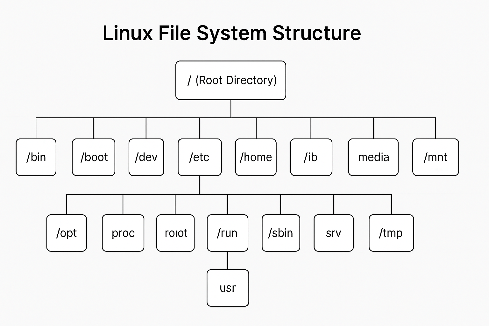
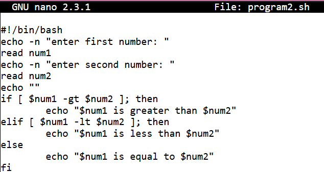
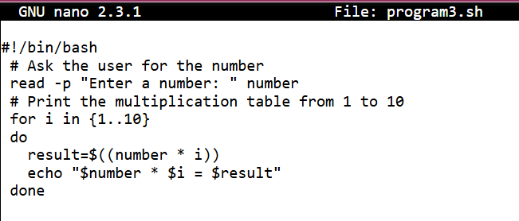
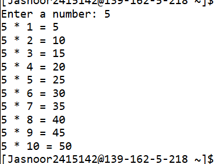

CSE_Training_2025

# Day 1 of Training

*Orientation Program*

- Firstly we attended orientation program organised by the faculty of CSE department in the auditorium
- There we learnt about our department, modules and faculty etc.

- **Topics Covered:**

**•Difference between Linux and Windows OS**
# Linux vs Windows - Basic Differences

| Feature              | Linux                                    | Windows                                 |
|----------------------|-------------------------------------------|------------------------------------------|
| Source Code          | Open Source                               | Closed Source                             |
| Cost                 | Free (mostly)                             | Paid License (some versions free)         |
| Customization        | Highly customizable                       | Limited customization                     |
| Security             | More secure (due to permissions & open code) | More targeted by viruses                 |
| Command Line         | Powerful and widely used                  | Optional, mainly GUI based                |
| Use in Servers       | Widely used (e.g., Ubuntu Server, CentOS) | Less common                              |
| Updates              | User-controlled, frequent small updates   | Automatic, sometimes forced              |
| Gaming               | Fewer native games, improving via Steam   | Most games supported                      |

**•Advantages of Linux over Windows:**
 -Free open source
 
 -More secure

 -Large and active community

**•Linux is used widely by most of the product and service based companies**

**•Learned about product based and service based companies**

**•Learned and explored about various carrier options under CSE**

**•Downloading process for linux:**
 •Dowloaded 3 softwares:
  
  -Oracle Virtualbox
 
  -Microsoft Visual C++
 
  -Ubuntu 24.04.02

  **•Booting and its types**
  - Booting is referred to as waking up the computer
  - # Cold Boot vs Warm Boot

| Boot Type  | Description                                                                 |
|------------|-----------------------------------------------------------------------------|
| Cold Boot  | When the computer is started from a completely powered-off state (eg, macOS). |          |
| Warm Boot  | When the computer is restarted without turning off the power (e.g.,windows).|

# Day 2 of Training
# Kernal
- It is a computer program that is a core of computer's Operating System

# Shell
- It is a computer program that acts as interface between user and OS.
- It basically acts as a translator

**Types**
 
| Shell Type |
|------------|
| sh         |
| bash       |
| zsh        |
| fish       |

**Categories**
- Command line shell
- Graphic shell

# Linux File System Structure

# Commands
- We learned and emplemented various commands in linux.
- Below are the commands we learnt today

| Command   | Description                            |
|-----------|----------------------------------------|
| `ls`      | Lists files and directories             |
| `whoami`  | Shows current logged-in user            |
| `date`    | Displays current date and time          |
| `cd`      | Changes the directory                   |
| `mkdir`   | Creates a new directory                 |
| `cat`     | Displays content of a file              |
| `touch`   | Creates an empty file                   |
| `cp`      | Copies files or directories             |
| `pwd`     | Prints current working directory        |
| `whereis` | Finds location of a command             |
| `whatis`  | Shows a brief description of a command  |
| `mv`      | Moves or renames files and directories  |

- After learning, we practiced these commands on an online terminal

**ls**

- It lists all the directories and files

**mkdir**
   - It makes a new directory by using 'mkdir filename'
   - Here we made a new directory names newdirectory

**cd**
  - It changes the directory you are working on
  - Here we changed the directory to newdirectory

  

**cat**
 - It is used to create a file with content by using '>' operator
 - It is also used to display a file
 - Here we created a file named file1 and typed our content and then displayed file1 with cat.

**touch**
 - It is used to create a file without content
 - Here we created a file named file2 without any content in it.

**cp**
 - It is used to copy one file to another by using 'cp source_file destination_file'.
 - Here we copied the content of file1 to file2.

**whereis,** **whatis,** **whoami,** **pwd**

**mv**
 - It is used to rename a file
 - It is also used to move a file to a new directory
 - Here we renamed the file file2 to newfile

# DAY 3 of Training

# File and Directory permossions
-In Linux (like Ubuntu), permissions decide who can do what with a file or folder.

**chmod**
- chmod stands for change mode. It is used to change the permissions of files or directories in Linux.

  **syntax**
  -chmod [permissions] [filename] **for permission*
  - ./filename.sh **for displaying*

**chmod +x filename.sh^**
- +x enables executable file

**chmod 444 filename.sh**
- 444 enables a read only file

**chmod 644 filename.sh**
- it enables permissions only to owner2.

# Redirection
- Redirection in Linux means sending the output or input of a command to somewhere else, like a file.
- Example: echo "Hello" > file.txt

## 🔄 Redirection Operators in Linux

| Type         | Symbol | Example Command                  | Description                             |
|--------------|--------|----------------------------------|-----------------------------------------|
| Output       | `>`    | `echo "Hello" > file.txt`        | Writes "Hello" to `file.txt` (overwrites) |
| Append       | `>>`   | `echo "World" >> file.txt`       | Adds "World" to end of `file.txt`        |
| Input        | `<`    | `wc -l < file.txt`               | Reads `file.txt` as input to `wc -l`     |

# Pipe '|'
- In Linux, a pipe (|) is used to connect two commands — it takes the output of one command and passes it as input to another.

  **syntax**
  - command1 | command2
  - command1 → generates output
  - command2 → takes that output as input

 ✅ Example:

ls | sort

📄 This lists all files (ls) and sorts them (sort).

# Practice Programs
# Program 1

**To display various variables**

*Output*

# Program2

**To find the greater between two numbers**

*Output*

# Program3

**To print a multiplication table of a number**

*Output*

